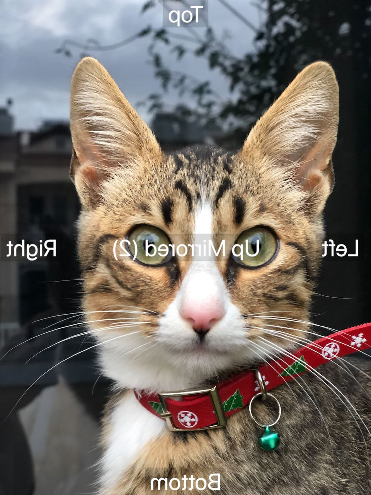
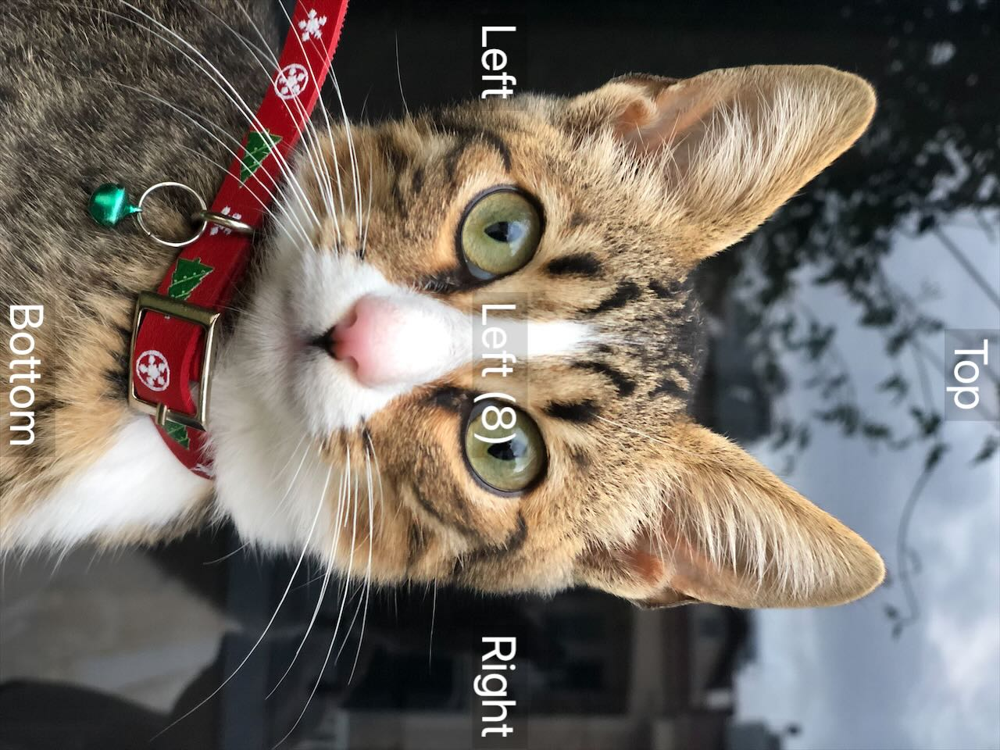

# SwiftOrientCrop

Project content:
- Oriented image generator
- Load and orient CGImage and CIImage
- Orient CGRect based on image orientation
- Crop CGImage, CIImage and vImage
- Speed/Memory/Storage benchmarks

Code located in [Tests](SwiftOrientCropTests/SwiftOrientCropTests.swift).

## Oriented image generator

Those images looks the same when correctly displayed, but under the hood they pretty different.

|  |  |  |
| --- | --- | --- |
|  |  |  |
|  | | |
